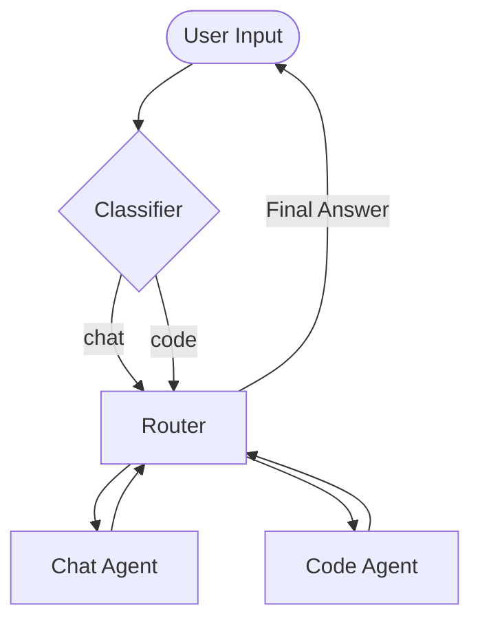

# langgraph-multi-agent-ai-message-routing-code-generation
LangGraph Multi-Agent AI for Message Routing and Code Generation Using GLM-4.5 and Zephyr-7B-Beta


# 🤖 LangGraph Agentic AI 

[](https://opensource.org/licenses/MIT)
[](https://www.python.org/downloads/release/python-31114/)
[](https://huggingface.co/)
[](https://github.com/astral-sh/uv)

An advanced multi-agent framework built on **LangGraph**. This project orchestrates specialized AI agents to handle natural language, execute code, and route tasks dynamically using a stateful graph architecture.


## ✨ Features

* **Intent Classification**: Uses a specialized node to detect if a query is `chat` or `code` based.
* **Multi-Agent Coordination**: Orchestrate specialized agents (`ChatAgent`, `CodeAgent`) to solve complex tasks.
* **Dynamic Routing**: The Router directs the flow based on the classification and current state.
* **Interactive Notebooks**: Designed to run in Jupyter for easy visualization of graph states.

---

## 🏗 System Architecture

The workflow utilizes a **StateGraph** where input is first classified before being processed by the router.





## 🚀 Installation & Setup

This project uses [uv](https://github.com/astral-sh/uv) for lightning-fast dependency management and is locked to **Python 3.11.14**.

### 1. Install Dependencies

Clone the repository and synchronize the environment:


# Clone the repository
```bash
git clone https://github.com/Dr-Mo-Khalaf/langgraph-multi-agent-ai-message-routing-code-generation.git
```
```bash
cd langgraph-multi-agent-ai-message-routing-code-generation
```

# Synchronize dependencies and setup environment
```bash
uv sync

```

### 2. Configure Environment Variables 🔑

The agents require a **Hugging Face API token** to function.

1. Create a `.env` file in the root directory if not exist:
```bash
touch .env

```


2. Add your token (get it at [hf.co/settings/tokens](https://huggingface.co/settings/tokens)):
```env
HUGGINGFACEHUB_API_TOKEN=your_hf_token_here

```


---

## 💻 Usage (Jupyter Notebook)

Since this project is built using `.ipynb` files, use **Jupyter Lab** to run the agents:

### Setup Jupyter

First, add JupyterLab as a development dependency:

```bash
uv add --dev jupyterlab

```

### Launch the Workspace

Start Jupyter Lab using the `uv` environment:

```bash
uv run jupyter lab

```

Once Jupyter opens, navigate to `main.ipynb` (or your friend's notebook file) and run the cells to start the agentic workflow.

---

## 🤝 Contributing

1. Fork the Project.
2. Create your Feature Branch (`git checkout -b feature/AmazingFeature`).
3. Commit your Changes (`git commit -m 'Add AmazingFeature'`).
4. Push to the Branch (`git push origin feature/AmazingFeature`).
5. Open a Pull Request.

---

## 📄 License

Distributed under the **MIT License**. See `LICENSE` for more information.

```

